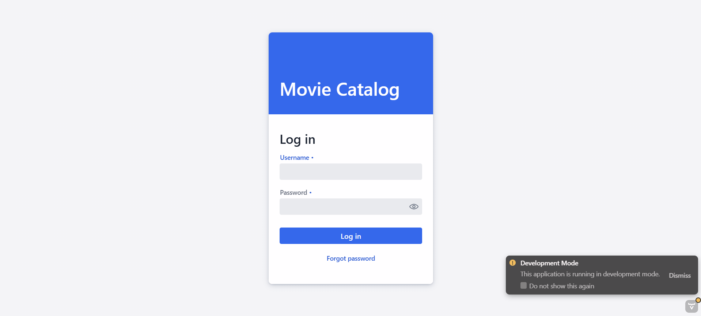
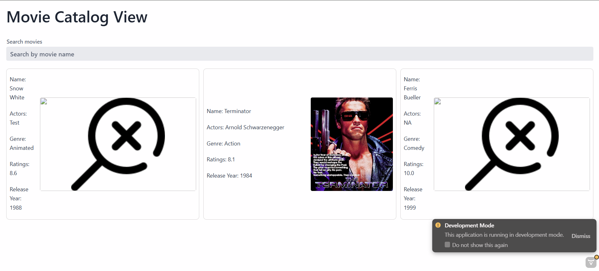
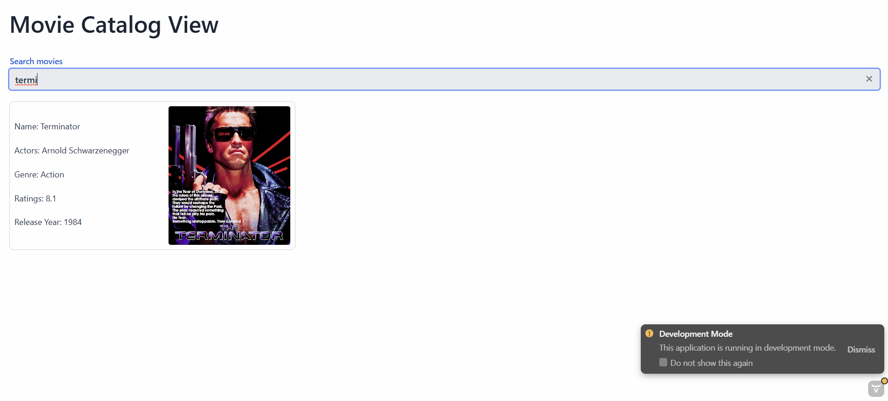
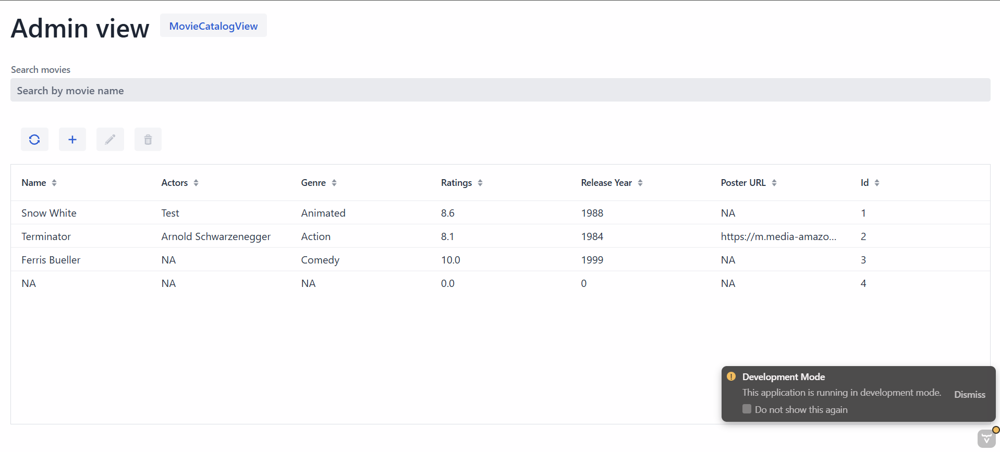
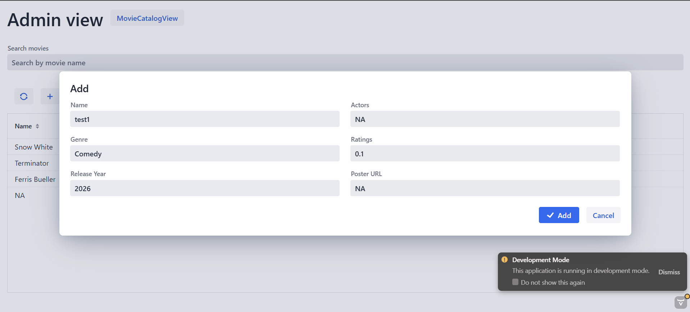
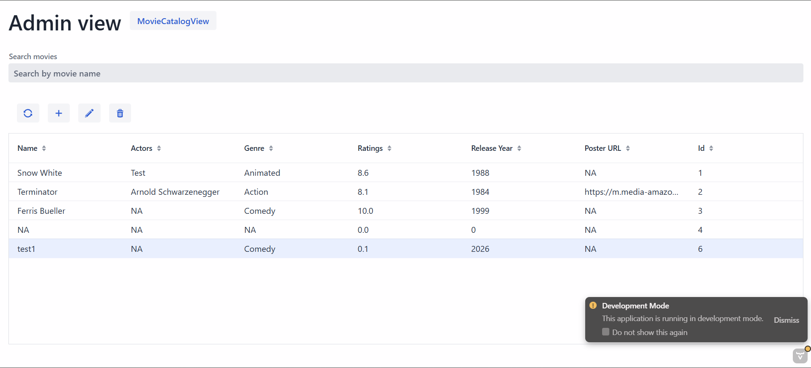
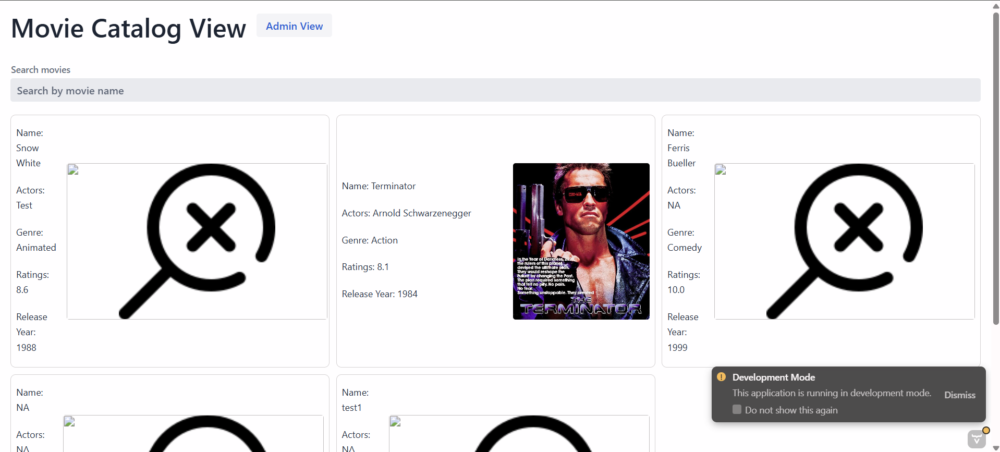

# Filmbase, a movie catalog service
## CSCI 2040U Final Project

---
### Basic setup instructions:
This project is designed to run as a server for a webapp (website application) for users to access via their Internet browser of choice. 

Ideally, no downloads or packages would be required, only a device with an Internet connection and a web browser. However, for the MVP 1.0, clone the project and open it in IntelliJ IDEA, and run the `MovieCatalogApplication.java` class to start the webserver.

Open your Internet browser of choice, and in the URL tab, enter and go to the link `http://localhost:8080/login`. This will lead you to the login page of the app.

Right now there is a demo view for both user and admin perspectives. The current placeholder login credentials are:
- User:
  - User1
  - password
- Admin
  - Admin1
  - password

We'll start with the user view. Enter the user credentials and click "Log in".
You will now be able to see the demo view of the main page, with a few different movie cards containing each movie's info.

The search bar currently only has search by movie name. Entering any string of characters (case-insensitive) that appear in any existing movie entry's name will only show that set of movies in the card view.

For example, searching for "termi" will provide the following view:

Now moving on to the admin view. Go back to the login page and enter the admin login credentials. You will now be greeted with the admin's exclusive database view of the movies rather than the home page of movie cards.

This page shows a table version of all of the movie entries, with each movie having a name, actors, genre, ratings, release year, poster URL, and ID.

The admin can add, edit, and delete entries in the table. Below is an example of adding an entry (after clicking the `+` button):

Clicking `Add` will add that entry to the table. The admin can also click on an existing entry and edit or delete it by clicking the respective button. Notice how the buttons are no longer greyed out in the image shown:

Finally, the admin can also switch to a "user" view by clicking on the blue button in the top left, to the right of the page name. This button shows the name of what view you can switch to.

Notice how the button changed to `Admin View`, showing that is the page you can switch to. Also notice how the new entries are visible in the catalog view as well.

---
### The Byte Council:
- Cai Penfold (Project Manager)
- Abbas Syed (Technical Manager)
- Shan Jeofry (Front-End Lead)
- Muhammad Nabeel Khan (Back-End Lead)
- Ethan Jallim (Software Quality Lead)